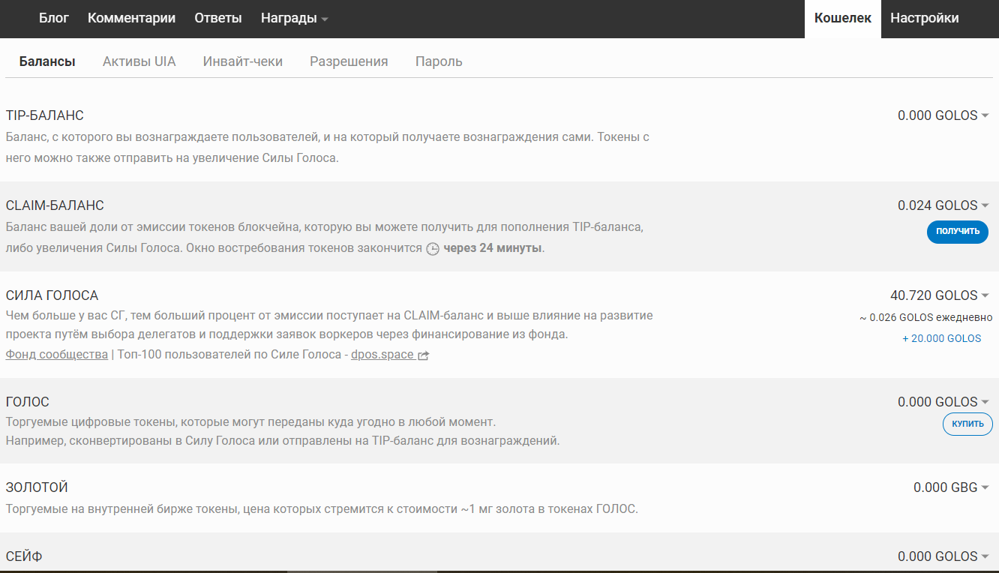
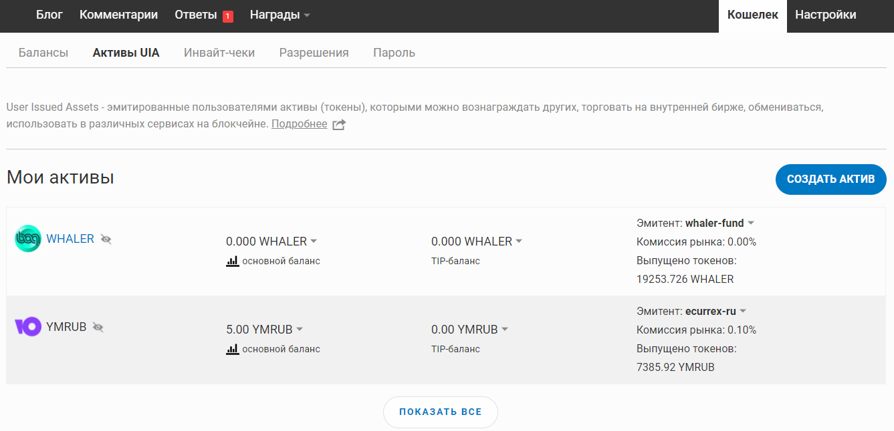
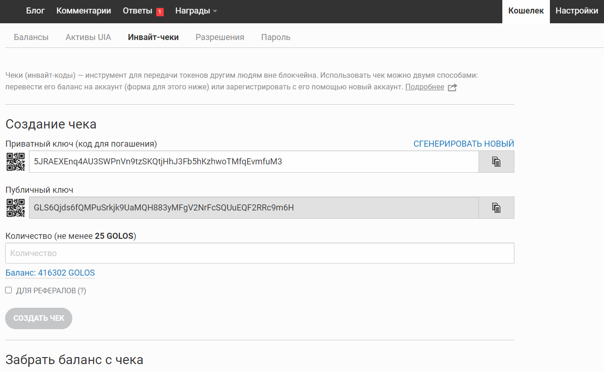
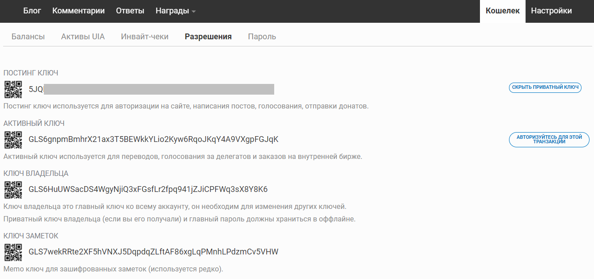
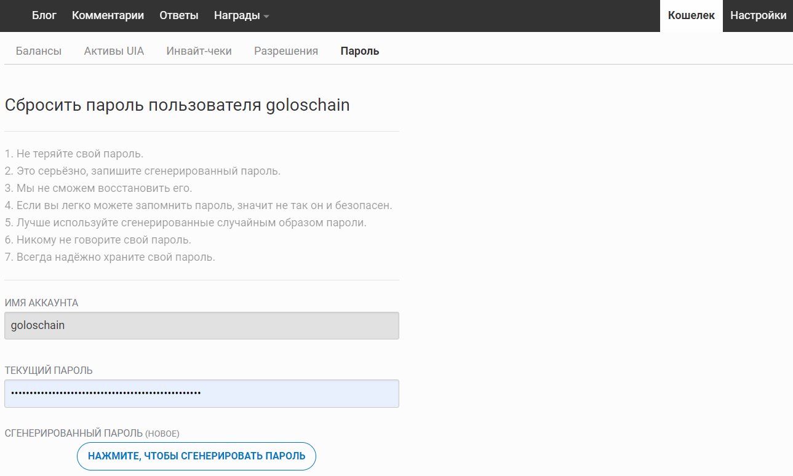

# Кошелёк

## Балансы 

На первой вкладке кошелька представлены все виды балансов основных токенов блокчейна Голос - GOLOS и GBG. Также, в конце страницы отображается история последних операций, связанных с переводами токенов.

### **НАКОПИТЕЛЬНЫЙ БАЛАНС**

По своей сути **** как "временный накопитель", чтобы отображать размер вашей доли от эмиссии токенов блокчейна, которая поступает (\~1 раз в час) пропорционально сумме Силы Голоса.


На момент написания данной информации, делегаты блокчейна установили период востребования токенов равным **1 неделе**.


При этом если в течение этого промежутка времени вы не забрали свою долю - токены будут переведены на баланс фонда сообщества для развития проекта.

> Опции из дополнительного меню:

* _Пополнить TIP-баланс_ - своего или другого аккаунта (нажав `РАСШИРЕННЫЕ ОПЦИИ`).
* _Увеличить Силу Голоса_ - позволяет получить токены с баланса в Силу Голоса, чтобы увеличить вашу долю в проекте, влияние на платформе и получать ещё больше токенов на CLAIM-баланс.

### **TIP-БАЛАНС**

Не повторяясь описанием с сайта, это специальный баланс, с которого возможна отправка токенов другим пользователям (кроме бирж) с помощью постинг ключа, который используется намного чаще в разных сервисах и ботах. Тем самым обеспечивается дополнительная безопасность токенов, лежащих на основном балансе ГОЛОС (4-й на картинке).

> Опции из дополнительного меню (стрелочка справа от суммы на балансе):

* _Передать_ **** - на другой аккаунт, при этом используется постинг ключ без необходимости ввода иных ключей или пароля.
* _Увеличить Силу Голоса_ - позволяет перевести токены с этого баланса в Силу Голоса, чтобы увеличить вашу долю в проекте, влияние на платформе и получать больший процент на CLAIM-баланс.

### **СИЛА ГОЛОСА**

Токены GOLOS, вложенные в ваш аккаунт на долгосрочное хранение, чем больше у вас СГ, тем больший процент от эмиссии поступает на CLAIM-баланс и выше влияние на развитие проекта путём выбора делегатов и поддержки заявок воркеров через финансирование из [фонда сообщества](../update.md#dobavlena-sistema-vorkerov).

Сила Голоса, говоря иносказательно, это акции платформы, а каждый пользователь имеет свою долю в проекте, как и получает дивиденды :)

> Опции из дополнительного меню:

* _Уменьшить Силу Голоса_ **** - вывод токенов в ликвидное состояние, который занимает 8 недель (раз в неделю равными долями 1/8 от той суммы, что была выбрана при включении понижения).
* _Делегировать Силу Голоса_ - передача в пользование части токенов с помощью которой другой пользователь сможет больше влиять на ранжирование (лайки/дизлайки), и иметь более весомые награды за курирование контента.

### **ГОЛОС**

Это основной ликвидный баланс главного актива/криптовалюты проекта, токены с этого баланса можно отправлять на биржи.&#x20;

> Опции из дополнительного меню:

* _Передать ****_ - на другой аккаунт. При переводе токенов на биржу или обменник не забывайте добавить заметку/memo, авторизоваться active-ключом или паролем для проведения транзакции.
* _Пополнить TIP-баланс_ - своего или другого аккаунта (нажав `РАСШИРЕННЫЕ ОПЦИИ`).
* _Увеличить Силу Голоса_ - перевести токены с баланса в Силу Голоса, чтобы увеличить вашу долю в проекте, влияние на платформе и получать больший процент на CLAIM-баланс.
* _Перевести в сейф_ - это делается для сохранности, если есть подозрения, что активный ключ или пароль был скомпрометирован. Токены в сейф попадают мгновенно, а обратный вывод проводится 3 дня.

### **ЗОЛОТОЙ**

Cвободно перемещаемый и торгуемый на [внутренней бирже](https://golos.id/ru--golos/@allforyou/torguem-na-vnutrennei-birzhe-golosa) токен, приравненный к 1 мг золота. [Подробнее о GBG](../faq.md#pochemu-vveden-token-gbg-zolotoi).

> Опции из дополнительного меню:

* _Передать_ **** - Золотые (GBG) передаются на другие аккаунты аналогично токенам GOLOS.
* _Перевести в сейф_ - так же, как и с GOLOS выше.
* _Конвертация в Голос_ - перевод токенов GBG в GOLOS занимает три с половиной дня. Конвертация осуществляется по среднему курсу в течение этих дней для снижения злоупотреблений спекуляцией.
* _Купить или продать_ - ссылка на торговлю GBG в паре к GOLOS через внутреннюю биржу.

### СЕЙФ

Баланс для обеспечения сохранности токенов. Если есть подозрения, что активный ключ или пароль был скомпрометирован вы можете перевести ликвидные токены GOLOS и GBG в сейф и спокойно заниматься вопросом смены ключей/пароля.&#x20;

## Активы UIA

User Issued Assets - эмитированные пользователями активы (токены), которыми можно вознаграждать других, торговать на внутренней бирже, обмениваться, использовать в различных сервисах на блокчейне.&#x20;

Подробнее о UIA и торговле ими на внутренней бирже можно почитать [здесь](https://golos.id/ru--golos/@allforyou/torguem-na-vnutrennei-birzhe-golosa).&#x20;

## Инвайт-чеки

Чеки (инвайт-коды) — инструмент для передачи токенов другим людям вне блокчейна. [Подробнее](https://golos.id/ru--golos/@lex/cheki-kak-instrument-peredachi-tokenov) о инвайт-чеках.\
\
Использовать чек можно двумя способами: перевести его баланс на аккаунт или зарегистрировать новый аккаунт.

[Пример создания](https://golos.id/ru--golos/@lllll1ll/registraciya-akkaunta-po-invait-kodu) инвайта и регистрации нового аккаунта.

## Разрешения 

На этой вкладке отображаются публичные ключи к вашему аккаунту, они начинаются с букв GLS и видны всем.

Приватные ключи зашифрованы и блокчейн производит их расшифровку с применением главного пароля (полученного вами при регистрации).\
\
Вы можете узнать приватные ключи аккаунта, напр. нажав`показать приватный ключ` напротив ПОСТИНГ КЛЮЧА, и введя пароль. Ключ начинается на цифру 5, скопируйте его и пользуйтесь для авторизации. \
\
Ключи разного уровня доступа позволяют вам обеспечить большую безопасность для аккаунта, так как даже потеряв или скомпрометировав постинг ключ, никто не сможет распоряжаться вашими токенами (для этого нужен активный ключ или главный пароль). &#x20;

### **Постинг ключ**

Используется для авторизации на сайте, отправки постов и комментариев, голосования (лайки/дизлайки), отправки вознаграждений/донатов (кнопка отблагодарить). При этом его можно использовать даже с чужого компьютера, пользоваться ботами, сторонними приложениями, не рискуя своим основным балансом.

### **Активный ключ**

Для перевода токенов, выбора делегатов, выставления ордеров на внутренней бирже.

### **Ключ Владельца**

Нужен для сброса ключей в случае если есть подозрения, что ключи или главный пароль скомпрометированы. Приватный ключ Владельца нельзя посмотреть в разделе разрешений, но полученный при регистрации главный пароль умеет всё тоже самое.

### **Ключ Заметок**

Memo ключ для зашифрованных к переводам токенов заметок (пока используется редко).


Ключи - это основа управления аккаунтом! Рекомендуется хранить их в нескольких местах, а главный пароль особенно.\
\
Не вводите ключи в поля для этого не предназначенные и на непроверенных сайтах или сервисах.


Может пригодиться пост на тему [как работают ключи](https://golos.id/ru--golos/@lindsay/kak-rabotayut-klyuchi-i-paroli-golosa) в Голосе.

## Пароль

Нажимая на вкладку **Пароль**, вы видите следующую страницу:

Эта вкладка понадобится только в том случае, если будет необходимость сбросить пароль (а вместе с ним будут сброшены и все ключи).
